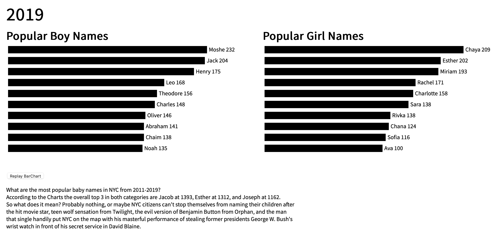

# Census Data for Popular Children Name from 2011- 2019

# How To Run the Project:

- Download the files in the Folder for Final_Project
- Be able to run it on a server to render the results

# [Census Project :: Click On Me To See Server Render](https://rongchengit.github.io/DataVis/Final_Project/)

# What The Graph Shows:

- It is a automated time series BarChart that shows the top 10 most popular baby names from 2011-2019 from NYC
- It shows one for Female, Male, and Year
- It shows the count and rankings for how many babies were born with that name along with their names

# What The Pictures Show:

- The pictures are hyperlinked to a funny video on Youtube via respect to the corresponding name
- It shows the top 3 most popular baby names for both genders
- It shows the missing the reason why 2018 data was missing via Leo

# How To Use Site:

- Allow the site to render every years data to see the full results on Bar Graph
- To rewatch Bar Graph Press the Replay Bargraph button
- To watch a funny video on the winners of the Names on the Bar Graph or for the missing 2018 Data, Click on the Pictures.

**Project Census:**
- Link and Images to the server to see the rendered results
# [Project Census :: Click On Me To See Server Render](https://rongchengit.github.io/DataVis/Final_Project/)

