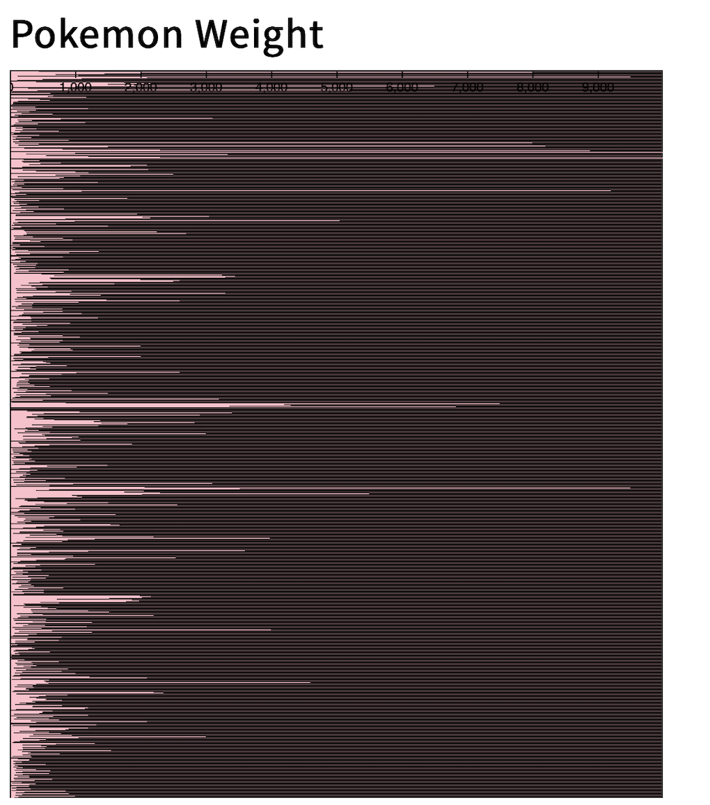
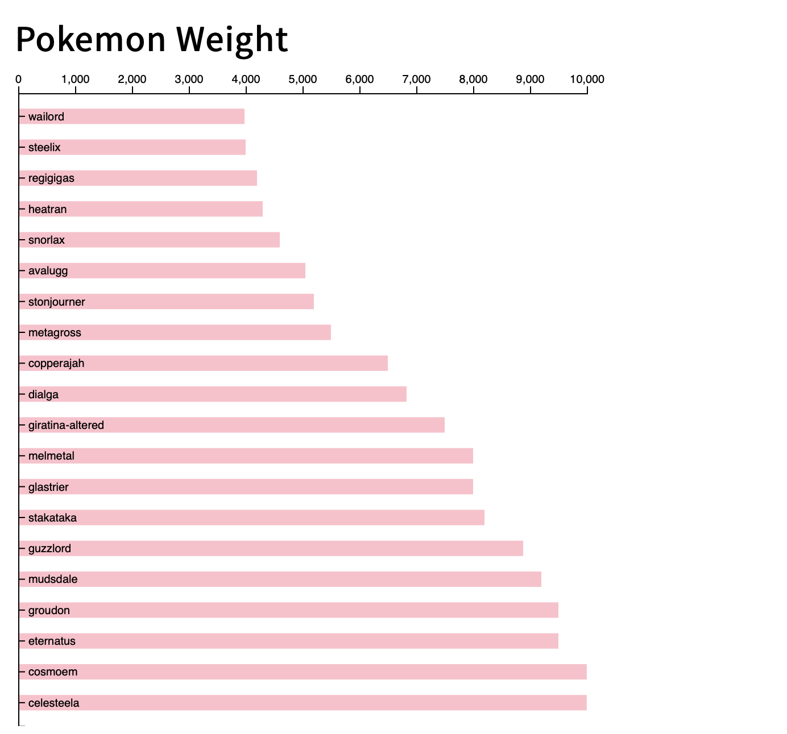

# Pokemon Weight Graph

# How To Run the Graph:

- Download the files in the Folder for Pokemon_Bar_Graph
- Be able to run it on a server to render the results
# [Pokemon Weight :: Click On Me To See Server Render](https://rongchengit.github.io/DataVis/Pokemon_Bar_Graph/)

# What The Graph Shows:

- It can show the top 25 Pokemon by sorted weight from Heaviest to Lightest from Generation 1-8 Via Bar Graph
- It can show the top 25 Pokemon by sorted weight from Lightest to Heaviest from Generation 1-8 Via Bar Graph

# How To Use Code:

- To render the results of Lightest to Heaviest or Heaviest to Lightest
- Open the main.js 
- Switch the letters(a,b) on both Sorts under the PokeW variable 

**Updates:**

# Iteration 1:
- Created a Bar Graph that showed over 900 Pokemon via Weight

# Iteration 2:
- Updated BarGraph to be readable via top 25
- Created a sort to display 
- Updated visual render
- Created display for Pokemon names and Pokemon Weight Scale

