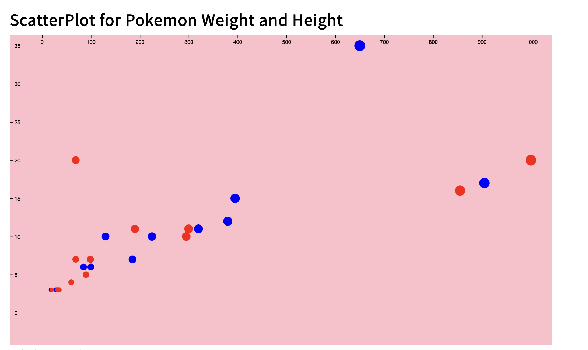

# Pokemon Height and Weight Scatter Plot

# How To Run the Graph:

- Download the files in the Folder for Pokemon_Scatterplot
- Be able to run it on a server to render the results
- [PokemonWeight And Height :: Click On Me To See Server Render](https://rongchengit.github.io/DataVis/Pokemon_ScatterPlot/)

# What The Graph Shows:

- It can show the top 25 Pokemon by circles rendered at different sizes to respect of Height and Weight

# How To Use Code:

- To render more than 25 pokemon for circles 
- Open the main.js 
- Under the slice() change the numbers inside to grab users wanting results

**Updates:**

# Iteration 1:
- Created a Scatterplot that showed all 900 Pokemon via Height and Weight

# Iteration 2:
- Updated ScatterPlot to be readable to 25 Pokemon
- Updated Render to show circle size via respect to Height and Weight
- Created display for Pokemon Height and Pokemon Weight Scale

